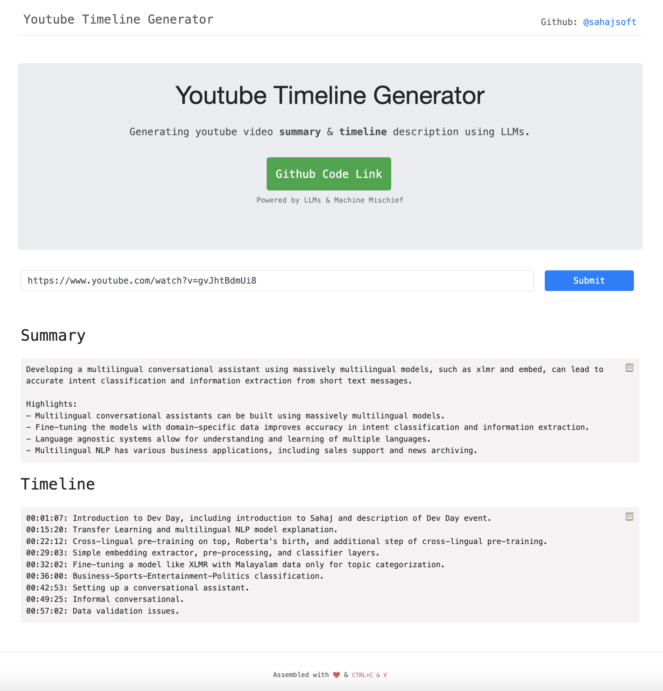

# LLM Video Timeline Description

## Description

This project is aimed at generating a video timeline description using LLMs. It allows users to generate summary and descriptive timelines for videos, making it easier to navigate through video.

# Screenshot



## Project Setup

1. Install Poetry:

   ```bash
   curl -sSL https://install.python-poetry.org | python3 -
   ```

2. Clone the repository
3. Navigate to the project directory
4. Create environment and Install project dependencies:

   ```bash
   poetry shell
   poetry install
   ```

## Usage

### Running the project for the first time?

1. Run the helper script for deploying LlamaEdge API Server on this machine and starting the server:

```bash
sh main.sh
```

The application can be reached at `http://localhost:5443`.

## Usage via Docker

Before you start, ensure your system meets the following minimum requirements to run the project using Docker:

- CPU: 8 cores
- Memory: 12GB
- Disk: 20GB

### Building the Docker Image

First, you need to build the Docker image for the project. Navigate to the project's root directory and run the following command:

```bash
docker build -t llm-video-timeline:dev .
```

### Running the Docker Container

After the image has been built, you can run the Docker container with the following command:

```bash
docker run -p 5443:5443 llm-video-timeline:dev
```

The application can be reached at `http://localhost:5443`.

## License

This project is licensed under the [MIT License](LICENSE).
